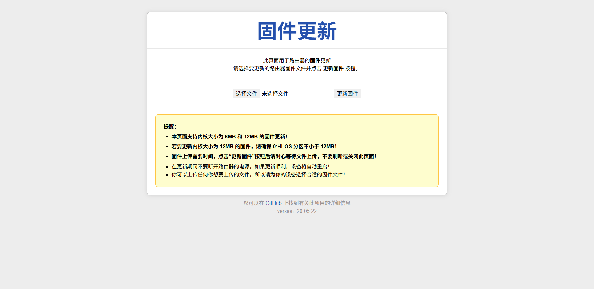

本仓库修改自：https://github.com/lgs2007m/uboot-ipq60xx-build

u-boot-2016 源代码基于：https://github.com/gl-inet/uboot-ipq60xx

## 适配设备

此 U-Boot 适配以下 IPQ60xx eMMC 机型：

- 京东云亚瑟（RE-SS-01）
- 京东云雅典娜（RE-CS-02）
- 红米 AX5 JDCloud（RA50）

## 编译步骤

```bash
# 编译环境：Ubuntu 22.04
# mbn 脚本使用 python2.7 运行，请安装并切换到 python2.7
# 若无法使用 apt 安装 python2.7，请使用其他方法安装
sudo apt install python2.7
sudo apt install build-essential device-tree-compiler
git clone https://github.com/chenxin527/uboot-ipq60xx-emmc-build.git
cd uboot-ipq60xx-emmc-build
./build.sh
```

## 文件说明

编译生成的 U-Boot 文件：uboot-ipq60xx-emmc-build/openwrt-ipq6018-u-boot.mbn

默认编译生成的 U-Boot，WebUI 更精美，但其文件大小超过了 640KB。而京东云亚瑟、京东云雅典娜、红米 AX5 JDCloud 等 IPQ60xx eMMC 机型的 0:APPSBL 分区大小只有 640KB。若要刷写此 U-Boot，请先扩容 0:APPSBL 分区。


若不想扩容 0:APPSBL 分区，可以将 `u-boot-2016/httpd/vendors/cleanwrt/` 中的文件替换为 `u-boot-2016/httpd/vendors/cleanwrt_tiny/` 中的文件，这样编译得到的 U-Boot 其 WebUI 较简陋，但其文件大小小于 640KB，可直接刷写，无需扩容 0:APPSBL 分区。



## 网址说明

| 功能        | 网址                          |
| :---------- | :---------------------------- |
| 更新固件    | http://192.168.1.1            |
| 更新 ART    | http://192.168.1.1/art.html   |
| 更新 CDT    | http://192.168.1.1/cdt.html   |
| 更新 IMG    | http://192.168.1.1/img.html   |
| 更新 U-Boot | http://192.168.1.1/uboot.html |
